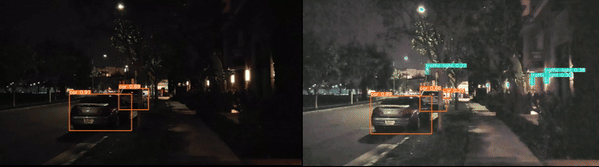
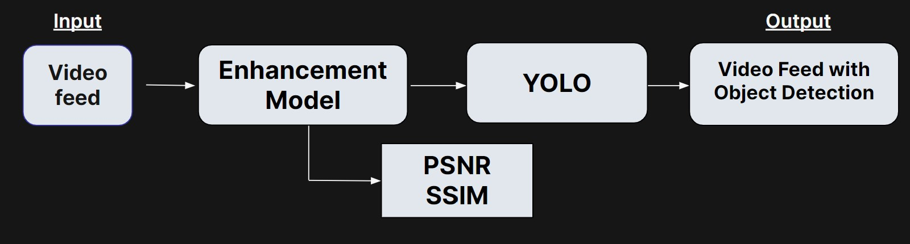
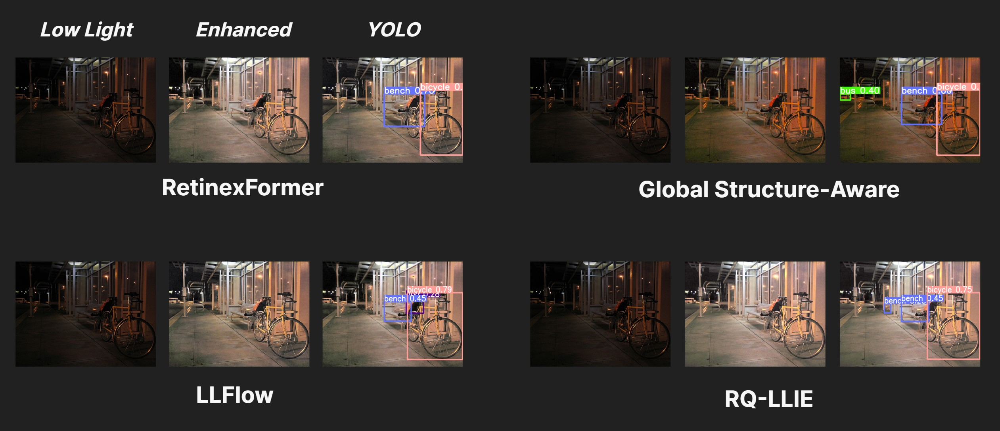
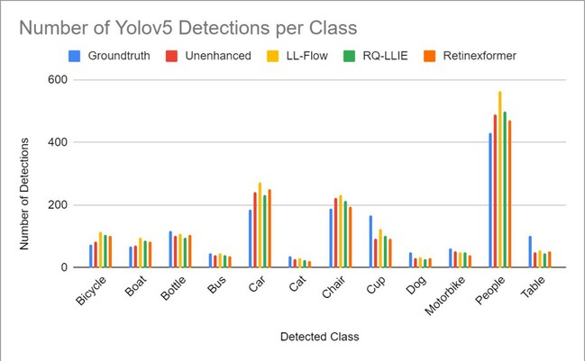

# Vision Guardian: Night-Vision Restoration! 😎
---

---

## Overview
This project focuses on enhancing image and video quality in low-light environments, particularly targeting the improvement of object detection in security camera footage. By addressing the challenges of lack of color and increased noise in low-light imagery, our solution aims to significantly enhance object recognition in dimly lit settings. Through the integration of noise reduction and color enhancement processes, coupled with object detection algorithms like YOLO, we aim to generate color-enhanced images with accurately detected object classes, thereby facilitating improved surveillance capabilities for security applications.
To assess the efficacy of our methodology, we plan to employ metrics such as Peak Signal-to-Noise Ratio (PSNR), Structural Similarity Index (SSIM), and Mean Average Precision (mAP) to evaluate image quality improvements quantitatively. Additionally, we consider the compatibility of different image enhancement models with the YOLO object detection framework, ensuring optimal performance and accuracy in detecting objects within the reconstructed images. Our comprehensive approach aims to not only enhance image quality but also to optimize object detection capabilities, contributing to advancements in security surveillance effectiveness, and comprehension in low-light conditions. 

## Tested Models
**Retinexformer:**\
	Retinexformer is a one-stage Retinex-based model to enhance low-light images. One component of the Retinex Former model is the Retinex-based One-stage Transformer (ORF), which estimates illumination information to brighten low-light images and restore corruptions to enhance the overall image quality. They introduce an Illumination-Guided Transformer (IGT)  and the Illumination-Guided Multi-head self-attention to model non-local interactions between regions with different lighting conditions, improving the algorithm's ability to capture long-range dependencies.
    The model was evaluated on the LOL(v1 and v2), SID, SMID, SDSD, and FiveK datasets. The model’s performance was measured using both PSNR and SSIM for quantitative results, and the model showed performance increases when compared to other various recent models while also having fewer parameters. Qualitative results were achieved using an image detection model. For the low-light images, the detector missed several objects or misidentified objects. However, in the enhanced image, all the objects were correctly identified. 

**Global Structure-Aware Diffusion Process for Low-Light Image Enhancement:**\
    Global Structure-Aware Diffusion Process for Low-Light Image Enhancement (GASD) is a novel diffusion-based method to boost the performance of low-light enhancement from the perspective of regularizing the ODE-trajectory. Diffusion-based generative models have delivered outstanding results with the advancements in denoising diffusion probabilistic models (DDPM) making them increasingly influential in low-level vision tasks. Most of the existing works tend to adopt pixel-wise objective functions to optimize a deterministic relationship, but such regularization frequently produces suboptimal resconstructions resulting in visibly lower reconstruction quality. The DDPM introduces a global structure-aware regularization scheme into the diffusing-based framework by gradually exploiting the intrinsic structure of image data. By introducing this structure-aware regularization scheme, it promotes structural consistency and content coherence across similar regions, contributing to a more natural and aesthetically pleasing image enhancement while preserving the image’s fine detail and textures. The authors tested their model with the LOLv1 and LOLv2 datasets. In their paper, the authors have stated that their PSNR is 27.839, and their SSIM is 0.877, respectively.

**Implicit Neural Representation for Cooperative Low-light Image Enhancement:**\
Implicit Neural Representation for Cooperative Low-light Image Enhancement (NeRCo) is an innovative method for enhancing low-light images, aiming to overcome several existing limitations. NeRCo employs an implicit Neural Representation approach to enhance images in an unsupervised manner, effectively addressing real-world degradation factors. By incorporating semantic-oriented supervision and a dual-closed-loop constrained enhancement module, NeRCo not only improves robustness but also reduces reliance on paired data, leading to more visually pleasing results. The reported SSIM of this paper is around 0.5360 which shows decent results but with some minor distortion.

**Low-Light Image Enhancement with Multi-stage Residue Quantization and Brightness-aware Attention:**\
Low-Light Image Enhancement with Multi-stage Residue Quantization (RQ-LLIE) presents a novel approach for enhancing low-light images by using normal-light image priors through a brightness-aware network. By incorporating a query module to extract reliable normal-light features and a brightness-aware attention module, the proposed method achieves more natural and realistic enhancements. Its utilization of prior data from normal-light images improves the robustness of the network to brightness variations. Experimental results demonstrate superior performance over existing state-of-the-art methods on both real-captured and synthetic data, suggesting its potential for enhancing visibility and quality in low-light image scenarios.

**Low-Light Image Enhancement with Normalizing Flow:**\
LLFlow introduces an interesting approach for low-light image enhancement using a normalizing flow model, which addresses the challenge of mapping low-light images to their normally exposed counterparts. This model captures complex conditional distribution of normally exposed images through an invertible network, facilitating the enhancement process. It significantly outperforms traditional methods on benchmark datasets such as LOL and VE-LOL, using metrics like PSNR, SSIM, and LPIPS, indicating superior restoration of color, detail, and reduction of noise and artifacts. On the LOL dataset, LLFlow achieved a PSNR of 25.19 and an SSIM of 0.93. In a cross-dataset evaluation on the VE-LOL dataset, it recorded a PSNR of 23.85 and an SSIM of 0.8986, when trained on LOL and tested on VE-LOL. With intra-dataset evaluation on VE-LOL, after retraining, it showed a PSNR of 26.02 and an SSIM of 0.9266. Additionally, LLFlow incorporates an illumination-invariant color map, enhancing image saturation and reducing color distortion. Extensive experiments validate the effectiveness of each component of LLFlow, showcasing its ability to produce high-quality, naturally enhanced images.

## Benchmarking Metrics
**Peak-to-Signal Noise Ratio (PSNR):**\
To calculate PSNR, we can begin by determining the dimensions of both the original and enhanced images. We then compute the pixel-wise squared difference between corresponding pixels in the original and enhanced images, subsequently calculating the Mean Squared Error (MSE). From this, we derived the PSNR values, considering both greyscale intensity and RGB values independently for each color channel. PSNR represents a ratio of quality and color intensity between two images

**Structural Similarity (SSIM):**\
Additionally, we will employ SSIM, which compares luminance, contrast, and structure between the original and reproduced images. Similarly to PSNR, SSIM compares pixels of the initial image and the enhanced image. However, this metric is potentially more accurate in assessing model outputs than PSNR due to its broader focus and more inputs, which will help us evaluate the success of our models.

**Mean Average Precision (mAP):**\
The mean average precision of a model is the average of its precision results across all detected classes. The precision of a model for a class for a singular image is the number of correct detections over the number of total ground truth objects in the image. A correct detection is defined as a detection bounding box that reaches a specified IoU threshold. The average precision of of the class for a model is the averages of these precision values of a whole dataset.

## Results:
Our models showed robust results in enhancing brightness, color, and reducing noise in test images.\

After enhancement, YOLOv5 was applied in detecting 12 images from the [Exclusively Dark Image Dataset](https://github.com/cs-chan/Exclusively-Dark-Image-Dataset). Results are below:\

YOLOv5 was then applied to [Seeing Dynamic Scene in the Dark: High-Quality Video Dataset](https://github.com/dvlab-research/SDSD) that had been enhanced with the above models:\

## 🔎 Running Models:
Please naviate to each model directory and check their README on instructions for running.

## 🔨 Benchmarking:
Visit **psnr-ssim-tool** for instructions on PSNR and SSIM metrics.\
Visit **mAP** for instructions on mAP metric.\
Visit **yolov5** for instructions on running object detection on outputs of models.
